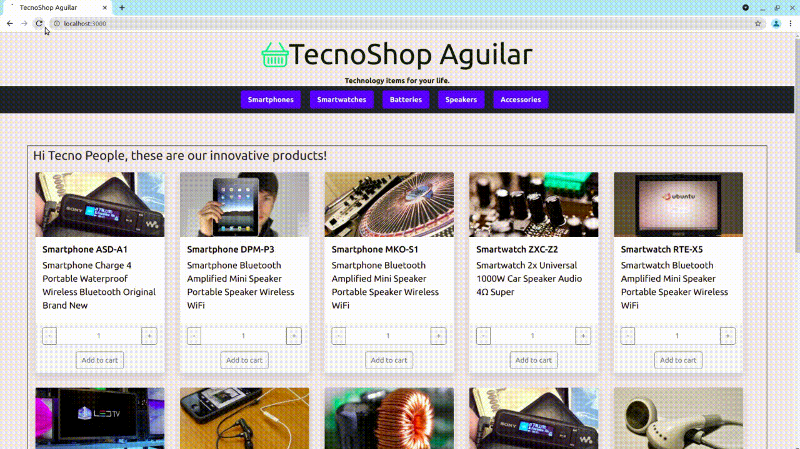

# TecnoShop Aguilar

- [TecnoShop Aguilar](#tecnoshop-aguilar)
  - [Prerequisites](#prerequisites)
  - [Get the project](#get-the-project)
  - [Start app](#start-app)
  - [Structure of code](#structure-of-code)

This repo contains a simple tecno shop based on ReactJs.
## Prerequisites

**Node**  
Install node (Ubuntu):
```bash
sudo snap install node --classic
```
Check the versions:
```bash
node --version
npm --version
```
This project was tested with node v14.17.3 and npm 6.14.13.

## Get the project

```bash
git clone https://github.com/mauriaguilar/tecnoshop-aguilar
cd tecnoshop-aguilar
git checkout Entrega11-Firebase
npm install
```

## Start app

```bash
npm start
```


## Structure of code

* App
  * NavBar
    * CartWidget
    * Button
  * Paths: **/** and **/category/:id**
    * ItemListContainer
      * ItemList
        * Item
        <!-- * ItemCount -->
  * Path: **/item/:id**
    * ItemDetailContainer
      * ItemDetail
        * ItemCount
  * Path: **/cart**
    * Cart
  * Path: **/\***
    * NotFound