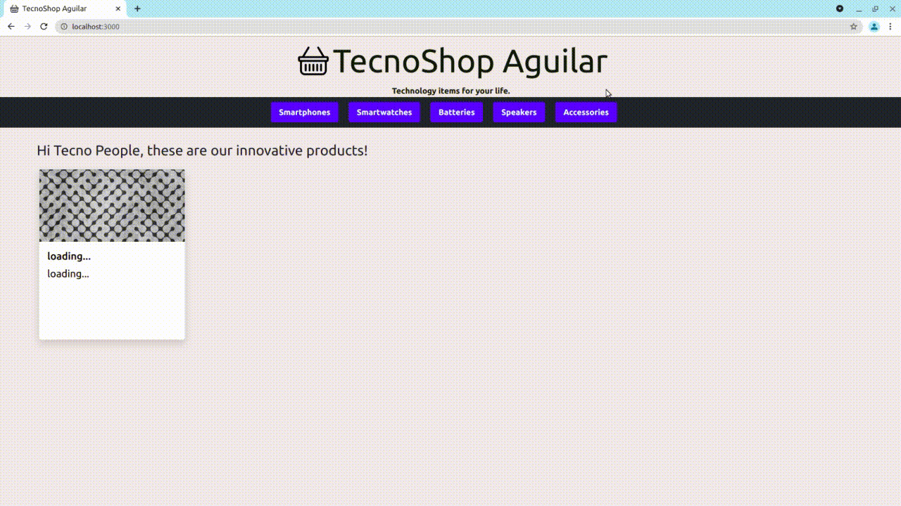

# TecnoShop Aguilar

TecnoShop is a basic technology store based on ReactJs, to display, select and purchase items.  
A demo example can be found here: [tecnoshop-aguilar.vercel.app](https://tecnoshop-aguilar.vercel.app/)

- [TecnoShop Aguilar](#tecnoshop-aguilar)
  - [📋 Prerequisites](#-prerequisites)
  - [🚀 Get the project](#-get-the-project)
  - [🔧 Start app](#-start-app)
    - [Considerations](#considerations)
  - [⚙️ Structure of code](#️-structure-of-code)
    - [Dependencies](#dependencies)
  - [🌆 Images & Photos](#-images--photos)

## 📋 Prerequisites

**Node**
Install node (Ubuntu):
```bash
sudo snap install node --classic
```
Check the versions:
```bash
node --version
npm --version
```
This project was tested with node v14.17.3 and npm 6.14.13.

## 🚀 Get the project
Download and install the project:
```bash
git clone https://github.com/mauriaguilar/tecnoshop-aguilar
cd tecnoshop-aguilar
git checkout main
npm install
```
Configure the environment variables provided, in the.env file:
```javascript
REACT_APP_FS_API_KEY="<api-key-here>"
REACT_APP_FS_AUTH="<auth-here>"
REACT_APP_FS_PROJID="<project-id-here>"
REACT_APP_FS_APPID="<app-id-here>"
```
## 🔧 Start app

```bash
npm start
```


### Considerations
* Each product has 5 units in stock: It is not possible to add more than 5 units of each product to the cart.
* When you click on the Buy button, a purchase order is generated: The products are removed from the cart but the stock in the database is maintained so that the application can continue to be used.
* The total price includes the shipping cost for each product: The product price is the number of units times the unit price. If the price of a product is greater than $100, the shipping cost will be $0 for that product.
## ⚙️ Structure of code

* App
  * NavBar
    * CartWidget
    * Button
  * Paths: **/** and **/category/:id**
    * ItemListContainer
      * ItemList
        * Item
  * Path: **/item/:id**
    * ItemDetailContainer
      * ItemDetail
        * ItemCount
  * Path: **/cart**
    * Cart
  * Path: **/checkout**
    * Checkout
  * Path: **/\***
    * NotFound
  * Others:
      * CartContext
      * Firebase
### Dependencies
  * Boostrap 5.0.2 ([docs](https://getbootstrap.com/))
  * Firebase 9.0.0 ([docs](https://firebase.google.com/))
## 🌆 Images & Photos
All images were downloaded from https://pixabay.com/ and Pixabay licensed.
([Credits](./public/img/README.md))